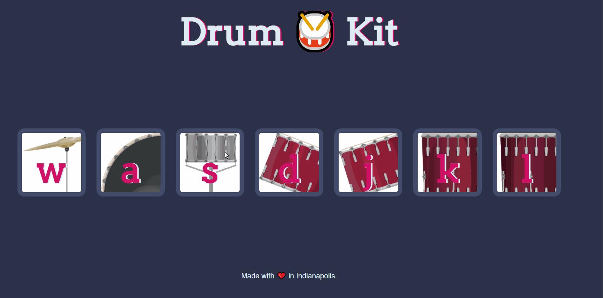

# Drum Kit Set

### App Description
A basic drum-kit web application that allows users to press a key or click on a button. In turn, the sound of a drum instrument is played.
Introduced the ideas of event handling and audio sources.

### App Walk-though

 

## Required
- [x] Drums play sound on key press.
- [x] Drums play sound on click.
- [x] Images are loaded and page is formatted.
